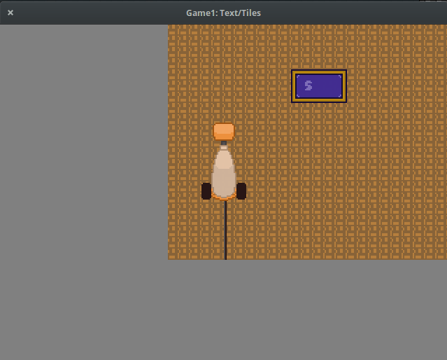
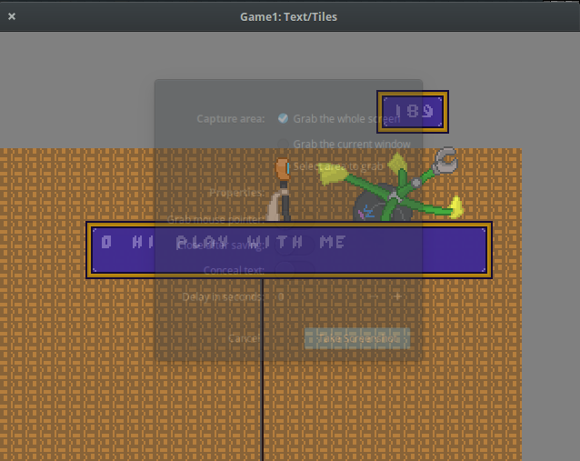

NOTE: please fill in the first section with information about your game.

# Vaccum Cleaner Overlord

*Vaccum Cleaner Overlord* is *Rahul Balakrishnan*'s implementation of [*Design Document*](http://graphics.cs.cmu.edu/courses/15-466-f17/game1-designs/rbalakr1/) for game1 in 15-466-f17.





## Build Notes

Always try to execute the python script [script](extract_png.py)

## Asset Pipeline

The png file assets.png must be used in conjugation with the textures.blob that can be generated using the script [script](extract_png.py).

A feature that should be implemented in the future writing a program that automatically extracts the assets.
Additionally it will be good to write a asset map and a small software to help create maps for the game.

## Architecture

The code works by importing all asset. Then organizing the data into a set of iterators and associated game objects.
A grid based collision detection system is also implemented.

Controls are accepted from the keyboard.
Up Arrow 	: move up
Down Arrow 	: move down
Left Arrow	: move left
Right Arrow	: move right

If you are in close proximity to an interactable hitting the 'A' key will launch dialogs.
The dialog can be dismissed by pressing any key other than 'A'.

The text was mapped by indexing in linear increments from the texture coordinate of 'a'.

The text used is a modified 'The Axeman Commeth' by Jim McCann.

## Reflection

Implementing wire movements and collisions consumed too much time. Slipping away from the allotted time.

Design document was extremely ambitious, it had a lot of requirement that needed to be simplified for the scope of this assignment.

# About Base1

This game is based on Base1, starter code for game1 in the 15-466-f17 course. It was developed by Jim McCann, and is released into the public domain.

## Requirements

 - modern C++ compiler
 - glm
 - libSDL2
 - libpng

On Linux or OSX these requirements should be available from your package manager without too much hassle.

## Building

This code has been set up to be built with [FT jam](https://www.freetype.org/jam/).

### Getting Jam

For more information on Jam, see the [Jam Documentation](https://www.perforce.com/documentation/jam-documentation) page at Perforce, which includes both reference documentation and a getting started guide.

On unixish OSs, Jam is available from your package manager:
```
	brew install ftjam #on OSX
	apt get ftjam #on Debian-ish Linux
```

On Windows, you can get a binary [from sourceforge](https://sourceforge.net/projects/freetype/files/ftjam/2.5.2/ftjam-2.5.2-win32.zip/download),
and put it somewhere in your `%PATH%`.
(Possibly: also set the `JAM_TOOLSET` variable to `VISUALC`.)

### Bulding
Open a terminal (on windows, a Visual Studio Command Prompt), change to this directory, and type:
```
	jam
```

### Building (local libs)

Depending on your OSX, clone 
[kit-libs-linux](https://github.com/ixchow/kit-libs-linux),
[kit-libs-osx](https://github.com/ixchow/kit-libs-osx),
or [kit-libs-win](https://github.com/ixchow/kit-libs-win)
as a subdirectory of the current directory.

The Jamfile sets up library and header search paths such that local libraries will be preferred over system libraries.
